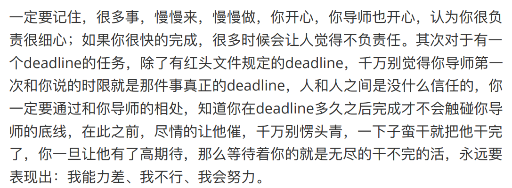
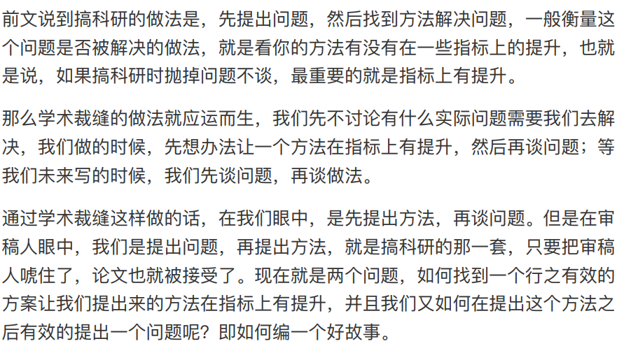
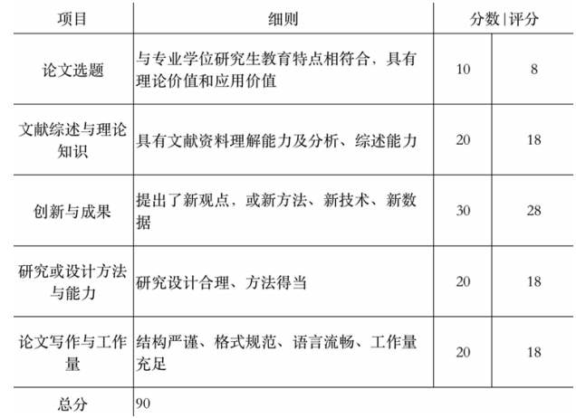
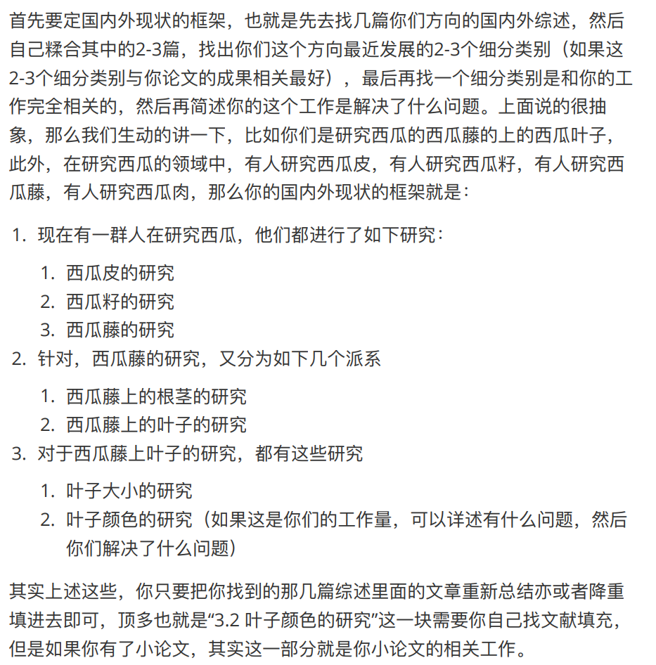

原始文档转载自：https://github.com/Flashcard8009/graduate-student-self-rescue

免责声明：本文只作转载，未有商业盈利行为。本资源仅作为学习交流用，请于下载后24小时删除。

## 绪论

1.关于研究生现状，和导师相处，保证自己顺利毕业，如何找工作

“基础的寻找和学习“

2.问清楚**实验室有哪些方向**，研一安排我主要完成哪些工作，之后我可以怎么选择

3.读研后目标问题：

工作地点，企业类型，定居/买房/结婚/父母养老

4.读研期间发文章问题：

首先要明确，论文各个分区，含金量，发文难度等等。

## 我的毕业目标

* 拿到一张硕士文凭，以后好找工作

## 实验室干哪些领域的活，可以给我怎样的提升

* 实验室主要是发论文/申专利/做项目（横向）？
* 在做的工作是哪些领域？入门难度怎么样？做的人多吗？有什么实用价值？学科或者行业交叉可能有多大？
* 已有成果可以给将来的工作哪些参考？
* 实验室的项目训练与哪些行业的哪些岗位对口？薪资如何？师兄师姐去向如何？

## 毕业要求

* 总则性要求，参看各自学院研究生院文件
  * 举例：上课 学位论文 创新成果（专利与论文） 专业实践（专硕） etc.
* 实验室有没有对毕业要求进行加码

## 导师类型

* 项目型导师
  * 国家基金拿了多少？导师本人和师兄师姐发了多少文章，层级如何？多少顶会？
  * push程度？是不是偶尔会关心我在做什么。但是基本没有指导
  * 放不放实习
* 问师兄有关实验室的情况
  * 发文章：毕业要求，实验室情况，哪些领域，哪些层次
  * 项目，主要做些什么？国家基金支持的，频率？

## 如何与导师相处？

* 很重要的一点：**示弱**。其实我之前就意识到了这一点，不知道在做本科毕设的时候，我有没有表现好。

  * 没有表现好。导已经明说了，我毕设时候过于拼，暑假太摆烂。

  * 但他认为我是突击型选手，这个误解还不错。

* 在你进⼊学校的那⼀刻， 就要清醒，⾃⼰的能⼒⼏⽄⼏两，然后导师承诺给你什么的时候，⼀定要三思 再三思，⾃⼰是否有那个能⼒得到他承诺的那些，以及师兄姐有没有⼈得到过 那些！

* # 只要你肯干活，那么就有干不完的活！！！

  * 好的一点是，我做了很久才把一个项目做的差不多，主要功能还没有实现
  * 不好的一点是，后期太拼了。**现在才意识到晚了**
  * 

### 怎么选方向？

* 方向有哪些？实验室能够提供的平台
* 如何选方向？
  * 只为毕业，选择好水论文的方向没错
  * 怎么判断好水论文？近三年该方向文章数目，好水的方向，成千上万
  * “我们不需要造航⺟，再 配上我的⾃救指南⾥的裁缝思想，我只能说两个字：⽆敌。”
  * “那么多⼈都能发论⽂，怎么就不能轮到你了，”

## 封装与继承

<!--莫名其妙感觉这个面向对象程序设计名词很适用于另一种情景-->

假设我要发个EI会议。那么，如果我独立实现了**一个大工程里的一个关键功能模块**。不过该模块主体工作量貌似需要我纯手搓，只是验证框架是现成的，**benchmark**也有，调试中遇到的问题也可以问师兄和导师。

大概只能算继承了三分之一。

封装，把开源代码改一改。倒是一个不错的选择。但我这个方向，不知道实验室有没有做过。

### 如何拒绝导师老登的不太合理要求？

1. ⾸先，⽆论是从理论层⾯还是技术实现层⾯，你都要去搜集资料，证明这个 东⻄很难，做不出来，我觉得这个应该很好证明，从未有⼈做过就是⼀个很 好的证明，然后不断地承认⾃⼰多垃圾，可能很多东⻄做起来很困难；
2.   在这个过程中，尽量找该⽅向的相似⽅向，⽐如让你做视频描述，你就去看 看图⽚描述，尽量就是按照章节“⽅向的选择”选择适合⾃⼰的⽅向，然后尽 量和你这个造航⺟的⽅向相似，如果实在找不到相似的，那就找和你导师提 供的其他⽅向相关的⽅向，亦或者你师兄姐相似的⽅向，总⽽⾔之，你得给 ⾃⼰找好下家， 同时给你导师台阶下；
3.  整理好所有的东⻄后，私底下去找你导师，记住是私底下找你的导师，和他 敞开了聊。

“造航⺟这个东⻄，不是特别想读博，不是下定决⼼搞科研，只想混个毕业，真 碰不了⼀点，多少个前⻋之鉴，否则三年你将会⾮常痛苦，⽽且最后还很容易 ⾛向学术不端。”

### 如何学习一些必要知识？

* 论文的层次与分区，参考原始文档
* 水论文：拼凑各个模块，前提是要看懂它们“做了什么”，对“为什么这么做”，理解优先级偏低。
* 要学一些模块技能的。但是，一切建立在基础技能学习之上
  * `除了胶⽔技能⽐模块 技能更基础之外，需要⽤到但⼀般不会在论⽂⾥提及到和展现到的技能⼀般是 胶⽔技能，因为这是很基础的技能；反之，⼀直在论⽂⾥提及的技能则多是模 块技能`
* 对于⽅向内专业技术的学习，可以去下载⼏篇你选择的⽅向的综述，英⽂的综 述要下载，中⽂的综述也要下载：
  * 英⽂综述（1-2篇引⽤次数᫾⾼的，精读⼀两篇即可）
  * 中⽂综述（2-3篇，少看不⾏，多看⽆益）
* gpt可以用来英文润色和中英互译。
  * prompt在原始文章中有

## 时间规划

* 打基础 还得补点 别懒了 球球了 多看看书 还有业界流行的什么什么协议框架
* 看论文，不过更多的是作为知识面的拓展，学一些算法什么的。主要关注在学习实验室已有项目的写法
* 做实验 不用说 天天在做
* 写论文 不说了 小论文 然后是大论文
* 找工作 能找实习研二就可以去了
* 写大论文 工作找的差不多了，然后回学校写大论文

### 关于联培

* 尽量不要去，注意专硕的实践要求是什么？

### 怎么看论文？

* 中文，英文综述都看几篇
* 先看水刊水会，再看顶刊顶会
  * 论文怎么写的；论文怎么包装的
* ⼀篇论⽂横竖就这⼏个版 块：摘要、引⾔、相关⼯作、⽅法、实验和总结，每个版块都是固定死的，以 及他们的作⽤和写法也都是固定死的

## 一种新奇的写论文方法：学术裁缝

* 先让一个东西在指标上有提升，再谈这个方法解决了什么问题。
  * 某些领域国产化做的少。我比不过国外成熟解决方案，还比不过国内的了？解决问题，直接套用宏大叙事，以及和国内其他高校研究相比。
* 但是，对外宣称的顺序肯定要反一下
* 
* 基准模型：原作者在文章里面做了个什么东西？尽量是顶刊顶会上找到的
* 模块：可以找，也可以自己做
* 缝合模块

### 开题？

* 开题答辩是你⾃⼰写⼀份开题报 告，然后做⼀个ppt去描述你未来要做什么，⽤什么技术做什么，然后下⾯⼀堆 专家听了你的讲述后，需要去帮你确定你定的⽅向，未来可不可⾏，需不需要 进⾏调整。
  * 绝⼤多数导师连⾃ ⼰学⽣做啥，做的什么可⾏不可⾏都不知道，还有⼼思管你
* https://www.bilibili.com/video/BV1814y1Z7HF/
* 适当画饼，本科毕设画的挺好的

### 实验怎么做？

* 性能对比实验，选取论文有讲究。要选择论文，比较高级的，但是未必主打性能，来比我主打性能的项目。
  * ⽤他的⽅法跑你的数据集，你可以改变实验参数，说⽩了，找个差⼀点的 参数结果，你不说，没⼈知道你跑过什么更好的参数。
  * 你复现过某篇论⽂，但是你复现的结果低于论⽂ ⾥的结果（单纯复现的时候必须使⽤原作者给的参数等等，即你不能对⼈家的 ⽅法试验参数改动⼀丝⼀毫），那就以你复现的为准。这个时候你只需要再在论⽂⾥附上⼀句，部分论⽂的结果是你复现 的结果即可。
  * 部分原始论文结果，部分复现结果均可
* 消融实验
  * C=Baseline+A+B
  * 基线加上我设计/缝合的模块，新增了什么功能？性能上有怎样的改善？
  * 只要是不能完全控制的变量都可以按照你想要的⽅式控制
* 实例分析其实就是通过图⽚的形式体现出你的⽅ 法的优越性
  * 找测试结果中最好的几个，说明
  * 把能通过测试的写上去了，又不是编的，真实存在

只要保证论文里面写的是对的就可以了，写啥不写啥是由自己决定的

讲故事：**最高级的撒谎是只说真话**。让别人单纯遐想出一个全新的故事

## 小论文怎么写？

* 研究生课程：研究生论文写作指导
* 微电子领域有哪些高质量的期刊/会议？
  * `(https://www.zhihu.com/question/22735229/answer/3267275804)`
* 小论文建议发一篇最基础的EI会议。这个问问导师，给不给
  * 挑一个第一个专利做的差不多的时间点
  * 小论文是大论文的基础，实际上来说小论文的要求是比较高的
  * 小论文发表，对大论文通过审核也是有一点作用
* 论文基本结构：摘要、引⾔、相关⼯作、⽅法、实验 和总结
  * 小论文的重点：创新
  * 大论文的重点：工作量
* 写学术论⽂的精髓就是，全篇论⽂都是我这 个东⻄哪⾥哪⾥好，解决了哪些看起来好像是能解决的问题，对于缺点却闭⼝ 不谈⼀个字。
* 别人的东西，我换几个节点，就成创新了
* 导师和实验室的资源决定上限。
* A+B+C
  * **复刻**： 我们发现了B问题，然后通过设计了⼀个⽅法A+B解决了这个问题， 相⽐᫾前⼈解决的更好；同理，也就是我们发现了C问题，然后通过设计了⼀ 个⽅法A+C解决了这个问题，相⽐᫾前⼈解决的更好。基准模型A解决的问题，也可以搬过来⼀起说
  * **堆叠**： B和C各自解决的问题加起来，解决了什么问题？甚至可以作为关键创新点
  * **强扯问题** ：没有需求我们就创造需求，可以是领域内普遍的问题
  * **捆绑销售**： 把好讲故事的模块和使得性能更好的模块放一起说，实际实验中未必两个都用到了。这就是为什么大多数学位论文肯定不开源。就算是专利人家也肯定看功能和性能，达到了管你是怎么实现的？
* 论文图片的应用
  * 摘要一张图，非专业地清楚简单表明论文做了什么工作，解决了什么问题
    * 但是摘要里边可以放图吗？
  * 方法图：我本科毕设做的就很好。先来一张主要模块数据流，然后再分开解释每个模块的组成
  * 总结图：一是用表格的形式来对比其他的研究成果。我们做硬件的不好搞生动形象的实例，或许可以将软件的测试结果，各项指标做上去？其实还是表格的形式了。。。
  * 图片形式的表达永远是最直观的！
* 小论文查重：
  * 摘要总结基本不会重复
  * 引言，方法，实验会存在框架上的重复，但写的东西还算自己原创
  * 相关工作部分容易重复，这时候找其他文章的重点，先缩写后扩写
* 发小论文：定位目标期刊，参考往年论文（就像看历年卷）
  * 纯模仿，包括文章结构，行文思路，图表规范，排版格式，英语润色
  * 别人有的，尽量都有；别人没有的，不要乱加
  * 顶刊的写作方法：
    * 讲故事：把自己提出的算法包装一下，这个一方面要多看论文才能有逻辑的堆砌专业名词，二方面需要请教有经验的人
    * 挑对比：肯定要对比“近几年发表的论文“，但是由于论文写作完成到正式发表经历的时间可能比较长，因此可以选到一些性能稍微差但是发表时间很近的论文
  * 水刊的写作方法
    * 换药不换汤（SCI四区）：同样方法，换研究领域
    * 换药不换汤（EI期刊）：同样领域，使用不同研究方法。该方法可以是别人方法基础上只做了一个小的改动
    * SCI水文写作框架，在指南末尾附录有说
  * 投哪个：
    * 国内核心：有逻辑的中文文笔，审稿速度1-3个月，难度较大，关系户多；认可度较低
    * SCI：三四区对英文写作要求低，gpt润色即可；一二区要求地道的英文表达；SCI级别越⾼，相对应的审稿速度会越快，⼀般⼀⼆区1-3个⽉，3区2-5个 ⽉，4区2-上不封顶（⼀年左右）。OA期刊的审稿速度快，1-2周；相对公平，但是有强的挂名作者比较好；认可度较高
    * EI会议：主要展现工作量；把⾃⼰的⽅法稍微总结下，带个引⾔带 个总结带个参考⽂献就快4⻚了
      * 方法：[实操演示有手就行的Ei会议5天录用，也许ei能打破唯论文论_哔哩哔哩_bilibili](https://www.bilibili.com/video/BV1jy4y1K7gu/?spm_id_from=333.999.0.0&vd_source=a9fa1e98943f08fc90f0e339ffc7dc11)
      * 投稿地址：https://www.ais.cn/attendees?invite=BZ606
      * 录用且要有ei检索，找个领域内相对稳定的ei会议
    * OA期刊：钱换SCI，但是近年来的趋势是出现预警和争议
      * 审稿速度很快，1-2周，难度较低；注意是否预警
      * 找出版社网站客服，问领域对应的OA期刊。例如Elsevier， Frontiers
  * 具体确认投哪个：
    * 找到所有可以投的：领域关键词，谷歌学术找，近3年期刊/会议汇总在表格，按照级别分类；
    * 定期刊级别：毕业无要求论文，可以投一篇EI会议玩玩；⽔⼀篇EI会议知道论⽂的这个流 程后，毕业论⽂的难度会⼤⼤降低
    * 具体确认：审稿周期，影响因子（低的肯定好投）
  * 落实到实处：
    * 阅读目标期刊官网的作者指南：排版应当使用latex，学的很快
  * 论文返修
    * 明确现实：给修改意见而不是拒掉，说明工作已经得到部分认可
    * 回答问题：全都回复；只要这个问题有⼀丝转机，就要舔到死；只要 这个问题⾮常客观的没有任何⼀丝转机，就得据理⼒争
      * 任何⾮你论⽂本身的问题，⾮审稿专家问题不知如何回复 的问题，⽐如是否能修改作者信息，⽐如修改稿件是否要标注等等，⼀定要发 邮件问编辑，⼀定要发邮件问编辑，⼀定要发邮件问编辑。
      * 舔：**引用专业内论文**解释提出的细节问题，用通俗语言解释创新点；补充实验只要不离谱，就做。要格式细节修改，加参考文献，无条件加。
      * 据理力争：如果要求过分，那也要**引用大量文献**，说明这个东西很难
    * 返修工作：
      * 修改模板一般没有，可以参考原始文档的示例（位于最后的附录7）
      * 修改处肯定要着重标出，没提到的地方但是修改了，那就悄悄改
* 小论文的新
  * 不仅是没见过的东西，还要解决了领域的什么问题（讲故事也要讲出来），或是对比比较先进的东西，要好一点。
  * 实验上要证明有效性，怎么证明之前讲了
  * 如果真**解决了什么问题**（让大家认为有这么一个问题存在）了，那么性能重要性就下来了。**奉献**，可以理解为开创了一个新的体系吗？或者一种新的思考解决问题的方法？
  * 就是有性 能，没贡献，可以，但是发⽂级别不会特别⾼；有贡献，没性能，也可以，发 ⽂级别中等；有贡献，有性能，发⽂级别会特别⾼。
    * ⼀般审稿专家先看性能，再看贡献，不是关系户，⽅法没有性能，只有贡 献，那么⼤概率就是拒，
    * 普通⼈，⾸选还是选择性能上的提升，然后尽量通过编 故事提升贡献。
  * ⼩论⽂不认可你的⼯作量，你做的⼯作量还必须 要有性能和贡献上的额外要求，毕竟⼩论⽂是要发表到期刊上证明你的能⼒ 的。

## 大论文怎么写？

* 评价体系：各个学校的应该大差不差
  * 
  * 一定按照评分表里的东西要求自己写的论文
* 论文写作
  * 排版，格式。本科毕设没少被说毛病吧？其实主要是同学收到的多一点。我自己要保持良好习惯，排版一定要多多检查
  * 尽量多用图表来表达
  * 按照师兄的论文写作思路，论文结构来。
* 论文选题
  * 与专业对应，这个不用担心。
  * 应用场景（举例：实现某种硬件肯定是软件有需求），理论技术（前人的工作就是理论基础，你魔改的就是技术）
* 文献综述
  * 
  * 国内外现状分类层次要清晰
  * 基础方法：工作用到什么写什么
* 创新与成果
  * 工作量表现为：新观点、新⽅法、新技术、新数据
    * 新观点、新⽅法、新技术：学术裁缝思想。缝合的模块就是新方法，新技术，糅合的观点就是新观点。一种方法换个领域，那么它就是新方法了
    * **方法内部的细节没必要过多展示**，采用什么方法做了什么事即可
    * 大论文看重工作量大于最后的性能指标和实际意义，不像小论文。我想专利也是这样子的，和小论文差不多
  * 工作量，一般要求有2到3个，最好是一定程度上相关
  * 这个东西是新的就行，没必要和最先进的争个高下
* 研究设计和方法
  * 只要放上足够多的图表，参考师兄大论文的写作，做了足够多的实验（对比实验，消融实验），实验结果足够合理。
* 查重，建议使用学校所用系统提前查一遍
  * 有些时候需要权衡，做什么事情不需要权衡！
* 要客观、实事求是的描述你研究⽣所做的⼯作即可，如果使⽤裁缝的 做法，两个⼯作量轻轻松松。

## 毕业答辩

* 学校自己审核自己学生，懂得都懂
* 盲审，硕士被为难的概率应该低于博士。少见硕士被卡盲审的
* ppt制作
  * 图多字少
  * 文字部分给专家留坑，专门等他问这些。
* 主要是要听话，姿态低，舔。本科毕设也算感受了一下了

## 写简历

* 网上有很多现成的模板
* 要求
  * 内容精炼，重点突出，比如学历，专业，重要的专利论文项目经历实习，不要过多专业术语，便于HR理解
  * 结构简单
  * 重点突出对找到这份工作有益，对口的成果。不要眉毛胡子一把抓
  * 附上一个简短的个人评价，可以参考mbti
  * ⽐如⾼校，⼀定就是突出论⽂经验；去企业，就是 突出项⽬经历。我知道你很有可能既有论⽂⼜有项⽬经历，但是我⽤的是突出 ⼆字，你可以都写，但是你得想办法突出他们想要看到的，⽐如进⾼校，就突 出论⽂的发⽂级别多⽜；如果进企业，就要突出项⽬多⾼端，反之，不要特意 去突出。说⽩了，就是重点突出的内容要控制，除⾮你是真的⽜。
* 技巧
  * 任何可以查证的内容都做不得⼀点假
  * 大公司的话，背调会比较严格，不要过度夸大。

## 笔试

* 这个感觉到时候就懂了

## 找工作的建议

* 养鱼
* 社会上的笔试是对**综合能力**的考察
* 面试：技术面什么的，还是要真正懂点东西的
  * 面试者希望你给出什么回答。
  * 有时需要掩盖自己真实意图，包装出来一个自我。多做准备能够自圆其说自己的动机
  * 如果⾯试是同 事问问题，你就需要站在同事的⻆度去考虑回答他的问题；如果⾯试的是领 导，你就需要站在下属的⻆度去考虑回答他的问题，说⽩了，就是⻅⼈说⼈ 话，⻅⻤说⻤话。要让他们觉得你这个⼈**很好相处**，**没什么坏⽑病**，**很听话**。
* 骑驴找马，大家都在做。违约金和更好的工作机会，哪个重要不言而喻。而且HR难道不也在养鱼？

**韧性**，只能在生活中培养

